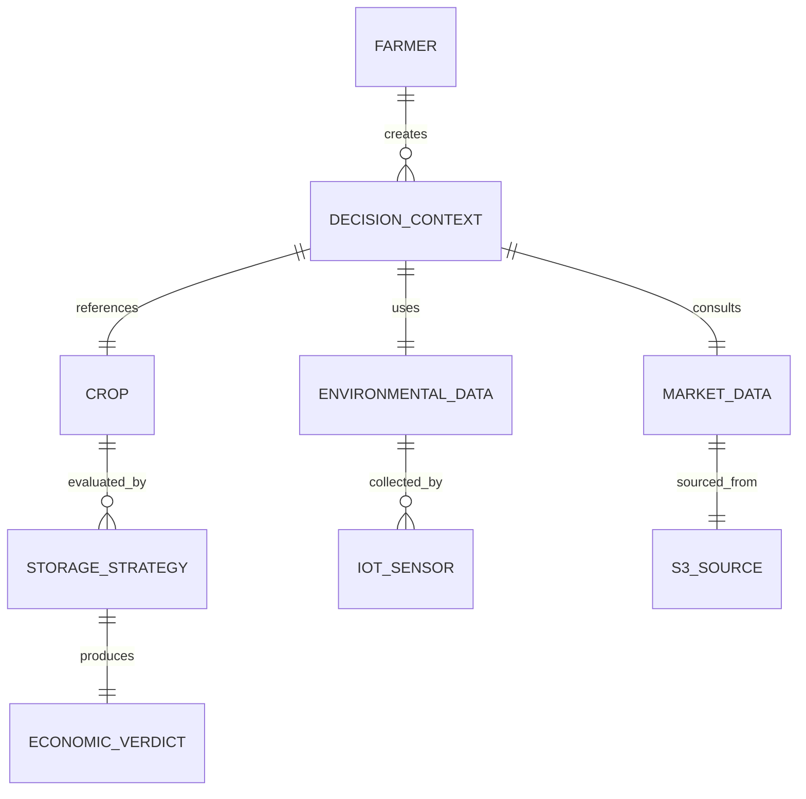

# Smart-Silo Storage Referee Design Document

## Overview

The Smart-Silo Storage Referee is a web-based decision support system that combines real-time IoT sensor data, market intelligence, and agricultural economics to provide farmers with optimal post-harvest storage recommendations. The system operates as an intelligent economic referee, weighing the trade-offs between cold storage costs and solar drying spoilage risks to maximize farmer profitability.

The application follows a three-tier information hierarchy: Context Collection (farmer inputs) → Environmental Assessment (IoT monitoring) → Financial Recommendation (economic verdict). This progressive disclosure ensures farmers understand both the inputs and reasoning behind each recommendation.

## Architecture

The system employs a modern web architecture with the following components:

### Frontend Layer
- **React-based SPA**: Responsive web application optimized for mobile field use
- **Real-time Dashboard**: Live updating interface with WebSocket connections for IoT data
- **Progressive Web App (PWA)**: Offline capability for areas with limited connectivity
- **Responsive Design**: Mobile-first approach with touch-optimized controls

### Backend Services
- **Decision Engine API**: Core recommendation logic with RESTful endpoints
- **IoT Data Processor**: Real-time sensor data ingestion and processing
- **Market Data Service**: S3-based market price management with caching
- **WebSocket Server**: Real-time data streaming to frontend clients

### Data Layer
- **S3 Storage**: Market price CSV files and historical data
- **Redis Cache**: Fast access to frequently requested market data
- **Time-series Database**: IoT sensor data storage and retrieval
- **Configuration Store**: Crop perishability scores and system parameters

### External Integrations
- **IoT Sensor Network**: Temperature and humidity monitoring devices
- **Market Data Feeds**: S3-hosted CSV files with current crop prices
- **Weather APIs**: Supplementary environmental data for enhanced predictions

## Components and Interfaces

### Core Components

#### 1. Farmer Input Interface
```typescript
interface FarmerInputs {
  cropType: CropType;
  distanceFromHub: number; // kilometers
  cropVolume: number; // quintals
  urgencyLevel: UrgencyLevel;
}

interface CropType {
  id: string;
  name: string;
  perishabilityScore: number;
  icon: string;
  averageMarketPrice: number;
}
```

#### 2. Environmental Monitor
```typescript
interface EnvironmentalData {
  temperature: number; // Celsius
  humidity: number; // percentage
  timestamp: Date;
  sensorId: string;
  riskLevel: RiskLevel; // GREEN, YELLOW, RED
}

interface RiskAssessment {
  solarDryingViability: number; // 0-1 scale
  spoilageRisk: number; // 0-1 scale
  environmentalMultiplier: number;
}
```

#### 3. Economic Calculator
```typescript
interface StorageOption {
  method: 'COLD_STORAGE' | 'SOLAR_DRYING';
  totalCost: number;
  expectedLosses: number;
  netValue: number;
  riskFactors: string[];
}

interface EconomicVerdict {
  recommendedOption: StorageOption;
  alternativeOption: StorageOption;
  reasoning: string;
  confidenceLevel: number;
  potentialSavings: number;
}
```

#### 4. Market Data Manager
```typescript
interface MarketData {
  cropId: string;
  currentPrice: number;
  priceHistory: PricePoint[];
  lastUpdated: Date;
  source: string;
}

interface PricePoint {
  date: Date;
  price: number;
  volume: number;
}
```

## Data Models

### Primary Entities

#### Crop Model
```typescript
class Crop {
  id: string;
  name: string;
  perishabilityScore: number; // 1-10 scale
  optimalStorageTemp: number;
  optimalHumidity: number;
  marketCategory: string;
  seasonality: SeasonalPattern;
  
  calculateSpoilageRisk(environment: EnvironmentalData): number;
  getMarketValue(volume: number, marketData: MarketData): number;
}
```

#### Storage Strategy Model
```typescript
class StorageStrategy {
  method: StorageMethod;
  baseCost: number;
  distanceMultiplier: number;
  environmentalRisk: number;
  
  calculateTotalCost(inputs: FarmerInputs, environment: EnvironmentalData): number;
  estimateLosses(crop: Crop, environment: EnvironmentalData): number;
}
```

#### Decision Context Model
```typescript
class DecisionContext {
  farmerInputs: FarmerInputs;
  environmentalData: EnvironmentalData;
  marketData: MarketData;
  timestamp: Date;
  
  generateRecommendation(): EconomicVerdict;
  validateInputs(): ValidationResult;
}
```

### Data Relationships



## Correctness Properties

*A property is a characteristic or behavior that should hold true across all valid executions of a system-essentially, a formal statement about what the system should do. Properties serve as the bridge between human-readable specifications and machine-verifiable correctness guarantees.*

### Property Reflection

After analyzing all acceptance criteria, several properties can be consolidated to eliminate redundancy:

- Properties related to real-time updates (1.2, 2.2, 6.2) can be combined into a single comprehensive real-time data propagation property
- Properties about visual feedback (2.1, 2.4, 4.2, 5.4) can be consolidated into UI responsiveness properties
- Properties about data validation (1.4, 4.1, 4.5, 6.5) can be combined into comprehensive input validation properties
- Properties about currency formatting (3.3, 6.3) are redundant and can be merged

### Core Properties

**Property 1: Crop data loading consistency**
*For any* valid crop selection, the system should load the correct perishability score and market data that matches the crop's defined characteristics
**Validates: Requirements 1.1**

**Property 2: Real-time calculation updates**
*For any* change in distance, volume, or market prices, all dependent financial calculations should update immediately and consistently throughout the interface
**Validates: Requirements 1.2, 6.2**

**Property 3: Proportional volume scaling**
*For any* crop volume input, all financial calculations (costs, losses, savings) should scale linearly with the volume multiplier
**Validates: Requirements 1.3**

**Property 4: Input validation completeness**
*For any* incomplete or invalid input combination, the system should prevent calculations and provide specific validation messages without crashing
**Validates: Requirements 1.4, 4.5**

**Property 5: Environmental risk calculation accuracy**
*For any* humidity and temperature readings above safe thresholds, the solar drying risk multiplier should increase proportionally, affecting the final recommendation
**Validates: Requirements 2.3, 2.2**

**Property 6: Visual feedback consistency**
*For any* environmental condition or system state change, appropriate visual indicators (colors, gauges, warnings) should be displayed consistently across all UI components
**Validates: Requirements 2.1, 2.4, 4.2, 5.4**

**Property 7: Recommendation completeness**
*For any* completed calculation, the system should display a side-by-side comparison with highlighted preferred option, clear reasoning, and financial projections in proper currency format
**Validates: Requirements 3.1, 3.2, 3.3**

**Property 8: Defensive data handling**
*For any* data access operation (S3, IoT sensors, market data), the system should implement null checks and graceful error handling without system crashes
**Validates: Requirements 4.1, 6.1, 6.5**

**Property 9: Responsive interface consistency**
*For any* device screen size or orientation, the interface should maintain full functionality with readable text, accessible controls, and proper visual hierarchy
**Validates: Requirements 5.1, 5.2, 5.3**

**Property 10: CSV parsing round trip**
*For any* valid market price data structure, serializing to CSV format then parsing should produce equivalent data with maintained precision and structure
**Validates: Requirements 6.1**

## Error Handling

### Error Categories and Responses

#### 1. Data Source Failures
- **S3 Market Data Unavailable**: Fall back to cached prices with timestamp warnings
- **IoT Sensor Disconnection**: Display last known values with staleness indicators
- **Network Connectivity Loss**: Enable offline mode with cached data and sync queues

#### 2. Input Validation Errors
- **Invalid Crop Selection**: Prevent calculation with specific crop requirement messages
- **Out-of-Range Values**: Provide boundary guidance and acceptable value ranges
- **Missing Required Fields**: Highlight incomplete sections with completion guidance

#### 3. Calculation Errors
- **Division by Zero**: Handle edge cases in percentage and ratio calculations
- **Overflow Conditions**: Implement bounds checking for large volume calculations
- **Precision Loss**: Maintain currency precision throughout calculation chains

#### 4. System Integration Failures
- **WebSocket Disconnection**: Implement automatic reconnection with exponential backoff
- **API Rate Limiting**: Queue requests with user feedback on processing delays
- **Cache Invalidation**: Refresh stale data with loading indicators

### Error Recovery Strategies

```typescript
interface ErrorRecovery {
  fallbackData: () => DefaultValues;
  retryMechanism: (operation: () => Promise<any>) => Promise<any>;
  userNotification: (error: Error) => UserMessage;
  gracefulDegradation: (feature: string) => AlternativeFlow;
}
```

## Testing Strategy

### Dual Testing Approach

The Smart-Silo Storage Referee requires both unit testing and property-based testing to ensure correctness across the complex decision-making algorithms and user interactions.

#### Unit Testing Framework
- **Framework**: Jest with React Testing Library for frontend components
- **Coverage Areas**:
  - Specific crop calculation examples with known inputs/outputs
  - Edge cases like zero volume, maximum distance, extreme weather
  - Integration points between components
  - Error boundary behavior

#### Property-Based Testing Framework
- **Framework**: fast-check for JavaScript/TypeScript property-based testing
- **Configuration**: Minimum 100 iterations per property test
- **Coverage Areas**:
  - Mathematical relationships in economic calculations
  - Data transformation consistency
  - UI state management across input variations
  - Error handling robustness

#### Property Test Requirements
- Each property-based test must run a minimum of 100 iterations
- Each test must be tagged with format: **Feature: smart-silo-referee, Property {number}: {property_text}**
- Each correctness property must be implemented by a single property-based test
- Tests must use smart generators that constrain inputs to valid agricultural ranges

#### Test Data Strategy
- **Crop Data**: Generate realistic crop types with valid perishability scores (1-10)
- **Environmental Data**: Constrain temperature (0-50°C) and humidity (0-100%) to realistic ranges
- **Financial Data**: Use realistic Indian rupee amounts and market price ranges
- **Distance Data**: Limit to practical transportation distances (1-500km)

#### Integration Testing
- **End-to-End Flows**: Complete farmer decision journeys from input to recommendation
- **Real-time Data**: WebSocket connection handling and data synchronization
- **Offline Scenarios**: PWA functionality and cache behavior validation
- **Mobile Responsiveness**: Cross-device compatibility and touch interaction testing

### Test Environment Setup
- **Mock Services**: S3 market data, IoT sensor feeds, WebSocket connections
- **Test Databases**: Isolated environments for each test suite
- **Performance Benchmarks**: Response time thresholds for real-time updates
- **Accessibility Testing**: Screen reader compatibility and keyboard navigation

The testing strategy ensures that farmers receive reliable, accurate recommendations regardless of input variations, environmental conditions, or system load scenarios.